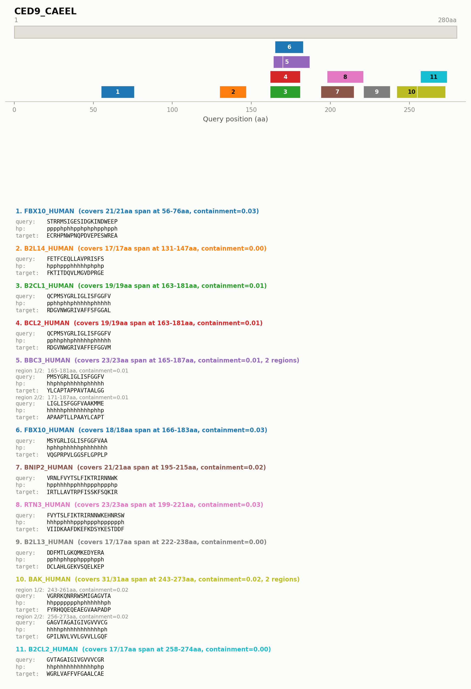

# Kmerseek

## Compiling on Mac

You may need to add these magical `export` commands to make your Python install work:

```bash
export MACOSX_DEPLOYMENT_TARGET=10.15 \
	&& export PYTHON_CONFIGURE_OPTS="--enable-framework" \
	&& export PYTHON_SYS_EXECUTABLE="$(which python)" \
	&& export PYO3_PYTHON="$(which python)" \
	&& export PYTHONPATH="/Users/olga/anaconda3/envs/kmerseek-dev/lib/python3.13/site-packages:$PYTHONPATH" \
	&& export DYLD_FALLBACK_LIBRARY_PATH="/Users/olga/anaconda3/envs/kmerseek-dev/lib:$DYLD_FALLBACK_LIBRARY_PATH" \
	&& export RUSTFLAGS="-C link-arg=-undefined -C link-arg=dynamic_lookup"
```

It may look like this:

```bash
export MACOSX_DEPLOYMENT_TARGET=10.15 \
        && export PYTHON_CONFIGURE_OPTS="--enable-framework" \
        && export PYTHON_SYS_EXECUTABLE="/Users/olga/anaconda3/envs/kmerseek-dev/bin/python" \
        && export PYO3_PYTHON="/Users/olga/anaconda3/envs/kmerseek-dev/bin/python" \
        && export PYTHONPATH="/Users/olga/anaconda3/envs/kmerseek-dev/lib/python3.13/site-packages:$PYTHONPATH" \
        && export DYLD_FALLBACK_LIBRARY_PATH="/Users/olga/anaconda3/envs/kmerseek-dev/lib:$DYLD_FALLBACK_LIBRARY_PATH" \
        && export RUSTFLAGS="-C link-arg=-undefined -C link-arg=dynamic_lookup"
```

## Testing

Run real-world examples like:

```bash
cargo run --example test_bcl2_processing
```

## Removing low-complexity k-mers

Low-complexity k-mers -- homopolymer runs like a poly-glutamate tract (`EEEEE`) or,
under a reduced alphabet, an all-hydrophobic window (`hhhhh`) -- are abundant and
carry little discriminative signal. Pass `--remove-low-complexity` at index time to
drop them:

```bash
kmerseek index -i proteome.fasta --ksize 10 --alphabet hp_lehninger2 --remove-low-complexity
```

Two independent checks run per k-mer: the **raw amino-acid** window (any encoding),
and for the HP-family alphabets the **HP-encoded** window as well. The second catches
windows that aren't raw homopolymers but still collapse to one symbol -- `LIVMA` is
five different residues that all encode to `h`.

Indexing reports what was removed, so you can tell whether the flag mattered:

```
Removed 75 of 9063 k-mer windows as low-complexity (0.83%)
```

The setting is **stored in the index**, and `kmerseek search` reads it back and
builds query sketches the same way. You don't repeat the flag when searching, and
search says plainly what the index holds and what it is doing:

```
Index: low-complexity k-mers were REMOVED when it was built
This search: low-complexity k-mers are REMOVED from query sketches (matching the index)
```

Pass `--remove-low-complexity` (or `--remove-low-complexity false`) to `search`
only to override that deliberately. Disagreeing with the index is allowed but
warned about:

```
This search: low-complexity k-mers are REMOVED from query sketches (--remove-low-complexity)
WARNING: this disagrees with the index. Containment is intersection / query_size,
so k-mers present on only one side still count toward the denominator and skew scores.
```

Results carry the setting too, in a `remove_low_complexity` column next to
`ksize`/`scaled`/`moltype`, so a CSV is self-describing without the command line
that produced it. It is a column rather than a `#` comment line because a comment
would break `pl.scan_csv` and every other plain CSV reader.

That symmetry matters. Containment is `intersection / query_size`, so if the index
dropped these k-mers but queries kept them, they'd match nothing while still
inflating the denominator -- deflating scores for exactly the queries containing
low-complexity regions.

Auto-generated filenames gain a `.nolowcomplexity` segment, so builds with and
without removal coexist instead of overwriting each other:

```
proteome.fasta.hp.k10.scaled1.kmerseek.rocksdb                  # default
proteome.fasta.hp.k10.scaled1.nolowcomplexity.kmerseek.rocksdb  # --remove-low-complexity
```

Removal is **off by default**; existing indexes and workflows are unaffected.
Note that only *exact* homopolymers are dropped -- a near-homopolymer such as
`hhhhhhhhhp` is kept.

## Visualizing hits

`scripts/visualize_hits.py` renders a per-gene PNG+SVG pair showing every hit
mapped onto the query protein: a full-length bar, each matched target's *actual*
matched regions positioned to scale (stacked into lanes when hits overlap, numbered
inside each box -- never floating text that can collide with a neighbor), and the
query / encoded-alphabet / target alignment printed beneath each hit, with every
region of a multi-region hit shown individually (not just one representative).
Each hit's containment, Jaccard, fold-enrichment, Poisson p-value, and a
Benjamini-Hochberg FDR-corrected q-value (corrected across every target actually
tested for that query, not just the ones kept after `--min-containment` filtering)
are printed alongside it. Categorical colors always come from a built-in matplotlib qualitative colormap,
sized to how many distinct targets there are (Set2 for up to 8, tab10 up to 10,
Set3 up to 12, tab20 beyond that) -- the alignment block's title is colored to
match its box. Example, `ced9.fasta` searched against a 25-protein BCL2-family
database (`hp_lehninger2`, k=17, every hit shown):



([SVG version](docs/images/ced9_hits_example.svg) -- sequence text stays selectable/copyable)

```bash
kmerseek search -q ced9.fasta -t bcl2_family.rocksdb -o results.csv \
    --alphabet hp_lehninger2 --ksize 17

python scripts/visualize_hits.py \
    --csv results.csv \
    --query-fasta ced9.fasta \
    --output-dir hits_png/
```

Use a `--ksize` of at least 12. Shorter k-mers under a reduced alphabet produce so many
overlapping sliding-window matches that the hit track becomes a wall of fragments.

`--query-fasta` supplies the full-length protein for the top bar and must be the
same FASTA used as the search query. Omit `--query-name` to render one PNG+SVG pair
per query found in the CSV. `--min-containment` and `--max-hits` are off by default
(every hit, for every target, is drawn); `--max-hits N` caps the figure to the top N
*distinct targets* by BH-corrected q-value, most significant first (all of a kept
target's hit spans are still shown, so one heavily-fragmented target can't crowd out
the others) -- use it to tame proteome-scale searches where a gene can have dozens of
distinct hits. See
`python scripts/visualize_hits.py --help` for all options.

## Alphabets

Pick one with `--alphabet` (`-a`). An alphabet is a partition of the 20 amino acids into
classes, applied to each residue before k-mers are extracted. Every name ends in the
number of classes, so a filename or a results CSV says how much reduction happened. The
partitions live in `src/rust/alphabets.rs`.

| Alphabet | Classes | Clusters | Source |
|---|:---:|---|---|
| `hp_lehninger2` | 2 | `AFGILMPVWY` `CDEHKNQRST` | Lehninger; also sourmash's `hp` |
| `hp_thomas_dill2` | 2 | `ACFILMVWY` `DEGHKNPQRST` | Thomas & Dill 1996 |
| `hp_kyte_doolittle2` | 2 | `ACFILMV` `DEGHKNPQRSTWY` | Kyte & Doolittle 1982, split at hydropathy > 0 |
| `hp_thomas_dill_no_c2` | 2 | `AFILMVWY` `CDEGHKNPQRST` | Thomas-Dill with C moved to polar |
| `hp_lehninger_c_nonpolar2` | 2 | `ACFGILMPVWY` `DEHKNQRST` | Lehninger with C moved to hydrophobic |
| `hp_pbotc_1st_ed2` | 2 | `ACFILMPVWY` `DEGHKNQRST` | Physical Biology of the Cell, 1st ed |
| `hp_lehninger_hpc3` | 3 | `AFGILMPVWY` `DEHKNQRST` `C` | Lehninger with C in a class of its own |
| `gbmr4` | 4 | `ADKERNTSQ` `YFLIVMCWH` `G` `P` | Solis & Rackovsky 2000 |
| `polarity4` | 4 | `GAVLIFWMP` `STCYNQ` `DE` `HKR` | Ball, Hill & Scott 2014 |
| `wwmj5` | 5 | `CMFILVWY` `ATH` `GP` `DE` `SNQRK` | Wang & Wang 1999 |
| `dayhoff6` | 6 | `C` `AGPST` `DENQ` `HKR` `ILMV` `FWY` | Dayhoff; also sourmash's `dayhoff` |
| `gbmr7` | 7 | `DN` `AEFIKLMQRVWY` `CH` `T` `S` `G` `P` | Solis & Rackovsky 2000 |
| `funcgroups8` | 8 | `GVALI` `ST` `CM` `FY` `WHP` `NQ` `DE` `KR` | Jain, Jain & Jain 2014 |
| `sdm12` | 12 | `A` `D` `KER` `N` `TSQ` `YF` `LIVM` `C` `W` `H` `G` `P` | Prlic et al. 2000 |
| `mmseqs12` | 12 | `AST` `LM` `IV` `KR` `EQ` `ND` `FY` `C` `G` `H` `P` `W` | Steinegger & Soding 2018 |
| `wass14` | 14 | `WM` `DI` `P` `C` `AV` `K` `T` `RE` `G` `L` `Y` `SH` `F` `NQ` | Ieremie et al. 2024 |
| `hsdm17` | 17 | `A` `D` `KE` `R` `N` `T` `S` `Q` `Y` `F` `LIV` `M` `C` `W` `H` `G` `P` | Prlic et al. 2000 |
| `uniprot18` | 18 | `A` `R` `N` `D` `C` `Q` `EP` `G` `HL` `I` `K` `M` `F` `S` `T` `W` `Y` `V` | Ieremie et al. 2024 |
| `protein20` | 20 | each residue its own class | no reduction |

Clusters are listed in the order their classes are numbered. The `hp_` alphabets write
their classes as `h` and `p`, and `hp_lehninger_hpc3` adds `c` for cysteine. Every other
alphabet writes a class as its first residue in lowercase, so an SDM12-encoded sequence
shows the `LIVM` class as `l` and can be read against the source residues directly.

The two- and three-class alphabets share an `hp_` prefix because they differ only on
borderline residues, which keeps a sweep easy to write and to grep. The rest use the
names their papers use, digit included, so `sdm12` and `gbmr4` can be looked up.
`polarity4` and `funcgroups8` have no name in their source and are named for what they
group on.

### The HP family

`AFILMV` is hydrophobic and `DEHKNQRST` is polar in every scheme, which a test pins.
The schemes differ only on C, G, P, W and Y, so they answer the same question about a
residue and disagree about five borderline cases.

Cysteine is the one they disagree about most, because its thiol side chain is nonpolar
but its disulfide bonding is a chemistry of its own. `hp_lehninger_c_nonpolar2` folds it
into `h`; `hp_lehninger_hpc3` gives it a third class instead, keeping Lehninger's split
for the other 19 residues.

### Choosing a class count

Peterson et al. (2009) benchmarked over 150 published clustering schemes against DALI
fold assignments and found that reduced alphabets beat the full 20-letter alphabet, with
the best results at 9-12 classes. GBMR4, SDM12 and HSDM17 were their top performers on
recall at 0.01 errors per query, AUC and mean pooled precision respectively. Each is a
refinement of the previous one: going from GBMR4 to SDM12 to HSDM17 only splits classes,
never moves a residue across an existing boundary
(`test_hsdm17_refines_sdm12_refines_gbmr4`).

Ieremie et al. (2024) reused those three and added five more when testing how alphabet
reduction affects protein language models. Rannon & Burstein (2026) added `funcgroups8`
and `polarity4`, and used the `mmseqs12` partition under its Linclust name: `funcgroups8`
gave over 1.5x input compression for 2.5-5.5% loss on enzyme and transporter
classification and the best solubility AUROC of the five alphabets they trained, and
`polarity4` had the lowest RMSE on stability regression. Those are language-model
results rather than search results, so they say which partitions are worth trying here,
not which will win. Where the papers overlap, their partitions are identical.

Two alphabets of the same size need not be related. `polarity4` keeps G and P with the
non-polar residues and splits acidic from basic, where `gbmr4` isolates G and P and pools
every charged residue into one class
(`test_gbmr4_and_polarity4_are_different_partitions`).

Class count and k-size trade off against each other, so a k that suits a 2-class alphabet
is usually too long for a finer one. Searching CED-9 against the 25-sequence BCL-2 test
file:

| Alphabet | k=10 targets / matched regions | k=5 targets / matched regions |
|---|---|---|
| `hp_lehninger2` | 21 / 1673 | none |
| `gbmr4` | 21 / 294 | 14 / 22234 |
| `polarity4` | 14 / 153 | 15 / 9884 |
| `funcgroups8` | 2 / 3 | 18 / 982 |
| `sdm12` | none | 17 / 110 |

At k=10, `gbmr4` finds the same 21 targets as `hp_lehninger2` in a fraction of the
matched regions, the selectivity gain Peterson et al. describe, while the finer
alphabets have almost nothing left. At k=5 that reverses.

### sourmash compatibility

sourmash calls an alphabet a moltype, and writes three of them. kmerseek reads all
three, storing each under the kmerseek name for the same alphabet:

| sourmash | kmerseek | hash function |
|---|---|---|
| `protein` | `protein20` | `Murmur64Protein` |
| `dayhoff` | `dayhoff6` | `Murmur64Dayhoff` |
| `hp` | `hp_lehninger2` | `Murmur64Hp` |

These three are the alphabets sourmash encodes itself, so kmerseek hands the sequence
straight to it rather than pre-encoding. A sketch or index carrying a sourmash name
therefore holds hashes kmerseek can read as-is, on the command line and from stored
index metadata:

```
Alphabet: HpLehninger (detected: hp)
Total matches: 21
```

### Amino acid disambiguation

Three one-letter codes stand for a pair of residues rather than a single one, because the
method that produced the sequence could not tell the pair apart. Asn and Gln deamidate to
Asp and Glu during acid hydrolysis, and Ile and Leu have the same mass:

| code | name | stands for |
|---|---|---|
| `B` | Asx | `D` (Asp, aspartate) or `N` (Asn, asparagine) |
| `J` | Xle | `I` (Ile, isoleucine) or `L` (Leu, leucine) |
| `Z` | Glx | `E` (Glu, glutamate) or `Q` (Gln, glutamine) |

kmerseek indexes every k-mer covering one of these under both readings, so a query
holding either residue matches. It does not pick one: under `sdm12` and `hsdm17`, Asp and
Asn fall in different classes, so choosing `D` for a `B` would assert a residue the source
never had.

Whether disambiguating adds k-mers depends on the alphabet, because the two readings do
not always encode differently. Under `dayhoff6` Asp and Asn are both class `c`, and under
the HP tables both are polar, so the two readings of a window produce the same encoded
k-mer and the same hash. Under `protein20`, `sdm12` and `hsdm17` they encode differently,
so the window yields two k-mers instead of one.

`PLANTANDANIMALGENBMES` is 21 residues with a `B` at index 17, so at k=5 it has 17
windows and four of them span the `B`. Those four, with both readings and what each
encodes to:

| window | residues | readings (`B` as `D`, `B` as `N`) | `dayhoff6` | `hp_lehninger2` |
|---|---|---|---|---|
| 13 | `LGENB` | `LGEND` `LGENN` | `ebccc` `ebccc` | `hhppp` `hhppp` |
| 14 | `GENBM` | `GENDM` `GENNM` | `bccce` `bccce` | `hppph` `hppph` |
| 15 | `ENBME` | `ENDME` `ENNME` | `cccec` `cccec` | `ppphp` `ppphp` |
| 16 | `NBMES` | `NDMES` `NNMES` | `ccecb` `ccecb` | `pphpp` `pphpp` |

Where each k-mer count comes from:

| alphabet | k-mers with `B` resolved to one residue | k-mers with `B` disambiguated |
|---|---|---|
| `protein20` | 17 | 21 |
| `sdm12` | 17 | 21 |
| `hsdm17` | 17 | 21 |
| `dayhoff6` | 17 | 17 |
| `hp_lehninger2` | 14 | 14 |

- `protein20`, `sdm12` and `hsdm17` keep `D` and `N` in different classes, so each of the
  four `B`-windows becomes two k-mers: 17 + 4 = 21.
- `dayhoff6` puts both in class `c`, so the four windows stay one k-mer each: 17.
- `hp_lehninger2` starts at 14 rather than 17, for a reason that has nothing to do with
  the `B`. With only two symbols, three pairs of ordinary windows already encode
  identically: `PLANT` and `ALGEN` are both `hhhpp`, `ANTAN` and `ANDAN` are both
  `hpphp`, `NTAND` and `NBMES` are both `pphpp`. Disambiguating adds none, so it stays
  at 14.

Disambiguating a residue doubles the readings of every window it falls in, so a window
containing *n* ambiguous residues yields 2^*n* disambiguated k-mers. kmerseek
disambiguates a window that is at most 10% ambiguous, meaning up to `ceil(ksize / 10)`
ambiguous residues. A window with more is dropped: indexing only part of its k-mers
would make matching depend on which subset was kept, which is worse than losing that one
window. SwissProt holds about 900 non-canonical residues in 207.6 M, so a window over
the cap should not arise.

`U` (Sec, selenocysteine) and `O` (Pyl, pyrrolysine) are handled differently. They are
specific residues rather than ambiguities, so each takes its closest canonical analogue,
`C` and `K`, under a reduced alphabet. Under `protein20` they are kept as themselves.

## Using the Builder Pattern

The `ProteomeIndex` now supports a fluent Builder pattern:

```rust
use kmerseek::index::ProteomeIndex;

// Using the builder pattern
let index = ProteomeIndex::builder()
    .path("/path/to/database.db")
    .ksize(5)
    .scaled(1)
    .moltype("protein20")
    .build()?;

// With auto filename generation
let index = ProteomeIndex::builder()
    .path("/path/to/base")
    .ksize(5)
    .scaled(1)
    .moltype("protein20")
    .build_with_auto_filename()?;

// With raw sequence storage
let index = ProteomeIndex::builder()
    .path("/path/to/database.db")
    .ksize(5)
    .scaled(1)
    .moltype("protein20")
    .store_raw_sequences(true)
    .build()?;

// Dropping low-complexity (homopolymer) k-mers
let index = ProteomeIndex::builder()
    .path("/path/to/database.db")
    .ksize(5)
    .scaled(1)
    .moltype("hp_lehninger2")
    .remove_low_complexity(true)
    .build()?;
```

You can also use convenience methods:

```rust
// Create a new index
let index = ProteomeIndex::new_simple(
    "/path/to/database.db",
    5,        // k-mer size
    1,        // scaled
    "protein", // molecular type
    false,    // don't store raw sequences
)?;

// With auto filename generation
let index = ProteomeIndex::new_with_auto_filename_simple(
    "/path/to/data.fasta",
    5,        // k-mer size
    1,        // scaled
    "protein", // molecular type
    false,    // don't store raw sequences
)?;
```

Run the builder pattern demo:

```bash
cargo run --example builder_pattern_demo
```
