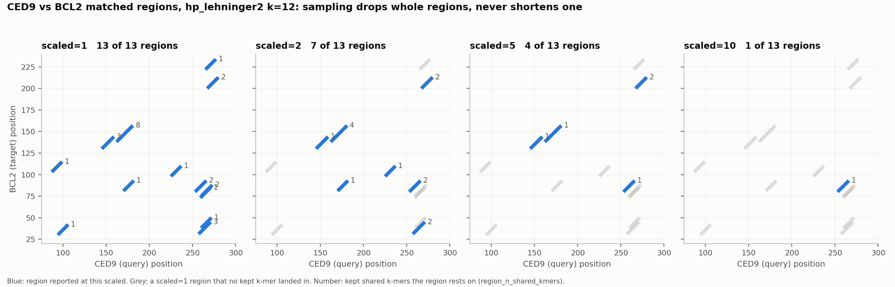
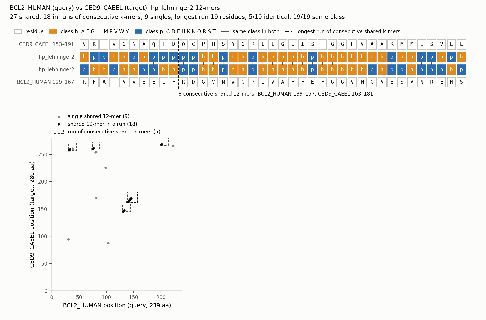

# Kmerseek

## Compiling on Mac

You may need to add these magical `export` commands to make your Python install work:

```bash
export MACOSX_DEPLOYMENT_TARGET=10.15 \
	&& export PYTHON_CONFIGURE_OPTS="--enable-framework" \
	&& export PYTHON_SYS_EXECUTABLE="$(which python)" \
	&& export PYO3_PYTHON="$(which python)" \
	&& export PYTHONPATH="/Users/olga/anaconda3/envs/kmerseek-dev/lib/python3.13/site-packages:$PYTHONPATH" \
	&& export DYLD_FALLBACK_LIBRARY_PATH="/Users/olga/anaconda3/envs/kmerseek-dev/lib:$DYLD_FALLBACK_LIBRARY_PATH" \
	&& export RUSTFLAGS="-C link-arg=-undefined -C link-arg=dynamic_lookup"
```

It may look like this:

```bash
export MACOSX_DEPLOYMENT_TARGET=10.15 \
        && export PYTHON_CONFIGURE_OPTS="--enable-framework" \
        && export PYTHON_SYS_EXECUTABLE="/Users/olga/anaconda3/envs/kmerseek-dev/bin/python" \
        && export PYO3_PYTHON="/Users/olga/anaconda3/envs/kmerseek-dev/bin/python" \
        && export PYTHONPATH="/Users/olga/anaconda3/envs/kmerseek-dev/lib/python3.13/site-packages:$PYTHONPATH" \
        && export DYLD_FALLBACK_LIBRARY_PATH="/Users/olga/anaconda3/envs/kmerseek-dev/lib:$DYLD_FALLBACK_LIBRARY_PATH" \
        && export RUSTFLAGS="-C link-arg=-undefined -C link-arg=dynamic_lookup"
```

## Testing

Run real-world examples like:

```bash
cargo run --example test_bcl2_processing
```

## Removing low-complexity k-mers

Low-complexity k-mers -- homopolymer runs like a poly-glutamate tract (`EEEEE`) or,
under a reduced alphabet, an all-hydrophobic window (`hhhhh`) -- are abundant and
carry little discriminative signal. Pass `--remove-low-complexity` at index time to
drop them:

```bash
kmerseek index -i proteome.fasta --ksize 10 --alphabet hp_lehninger2 --remove-low-complexity
```

A k-mer is dropped when its **encoded** window is a run of one symbol. Under
`protein20` that is a raw homopolymer. Under a reduced alphabet it also catches windows
that aren't raw homopolymers but collapse to one class -- `LIVMA` is five different
residues that all encode to `h` under the Lehninger split, and `EEEDD` encodes to
`ccccc` under `dayhoff6`.

Indexing reports what was removed, so you can tell whether the flag mattered:

```
Removed 75 of 9063 k-mer windows as low-complexity (0.83%)
```

The setting is **stored in the index**, and `kmerseek search` reads it back and
builds query sketches the same way. You don't repeat the flag when searching, and
search says plainly what the index holds and what it is doing:

```
Index: low-complexity k-mers were REMOVED when it was built
This search: low-complexity k-mers are REMOVED from query sketches (matching the index)
```

Pass `--remove-low-complexity` (or `--remove-low-complexity false`) to `search`
only to override that deliberately. Disagreeing with the index is allowed but
warned about:

```
This search: low-complexity k-mers are REMOVED from query sketches (--remove-low-complexity)
WARNING: this disagrees with the index. Containment is intersection / query_size,
so k-mers present on only one side still count toward the denominator and skew scores.
```

Results carry the setting too, in a `remove_low_complexity` column next to
`ksize`/`scaled`/`moltype`, so a CSV is self-describing without the command line
that produced it. It is a column rather than a `#` comment line because a comment
would break `pl.scan_csv` and every other plain CSV reader.

That symmetry matters. Containment is `intersection / query_size`, so if the index
dropped these k-mers but queries kept them, they'd match nothing while still
inflating the denominator -- deflating scores for exactly the queries containing
low-complexity regions.

Auto-generated filenames gain a `.nolowcomplexity` segment, so builds with and
without removal coexist instead of overwriting each other:

```
proteome.fasta.hp.k10.scaled1.kmerseek.rocksdb                  # default
proteome.fasta.hp.k10.scaled1.nolowcomplexity.kmerseek.rocksdb  # --remove-low-complexity
```

Removal is **off by default**; existing indexes and workflows are unaffected.

Note that only *exact* homopolymers are dropped -- a near-homopolymer such as
`hhhhhhhhhp` is kept.

### Indexing a large proteome: `--scaled`

Nearly all of an index's cost is per k-mer: at k=10 each residue adds about 660
bytes of k-mer bookkeeping during indexing on top of ~20 bytes that do not depend on
the k-mer count, and about 79 bytes on disk. `--scaled N` keeps only the k-mers whose
hash falls in the lowest `1/N` of the hash space (FracMinHash), so the same k-mer is
kept or dropped in every sequence and the per-k-mer cost falls almost linearly with N:

```bash
kmerseek index -i uniref50.fasta.gz --ksize 10 --scaled 5
```

| `--scaled` | indexing memory per residue | index on disk per residue |
|---|---|---|
| 1 | 683 B | 79 B |
| 2 | 362 B | 40 B |
| 5 | 162 B | 17 B |
| 10 | 87 B | 9.7 B |

(Measured on a 55,486-sequence UniRef50 sample at k=10, protein20. The memory column
is for the indexer in this release, which holds every k-mer in memory until the index
is written; with it, Swiss-Prot's 208 M residues need ~140 GB at scaled=1 and ~18 GB
at scaled=10.)

The value is stored in the index and search reads it back, so `search` takes no
`--scaled` flag and cannot disagree with the database.

What sampling costs is sensitivity to short matches. A matched region is reported
from any one of its k-mers that survived the cutoff: search grows that k-mer back out
along the stored sequences to the full exact match, so a reported region is always
the whole match, never a fragment. A match none of whose k-mers survived is missed.
A region with `n` k-mers survives with probability `1 - (1 - 1/N)^n`: at
`--scaled 5`, a 12-residue match at k=12 (one k-mer) is found 20% of the time, a
19-residue match (8 k-mers) 83% of the time. The `region_n_shared_kmers` column then
counts surviving k-mers, and the region Poisson score is computed against an
expectation summed over the same survivors, so the two stay comparable.



Choose N from the shortest match you need to see reliably, not from k. The cap is 10.

## Extending matched regions past the exact seed

A matched region is a maximal run of shared k-mers: one position where the encoded
query and target disagree ends it. Between remote homologs the HP pattern is conserved
per position (the copy rate, Cohen's κ, is about 0.45 at 20-30% identity) far better than
any 23-residue stretch of it is conserved exactly (most such pairs share no exact
23-mer at all), so an exact run is better read as a seed than as the match.

`--extend-mismatch-penalty C` grows each region outward along the encoded sequences,
scoring +1 per agreeing position and -C per disagreeing one, and stops when the running
score has fallen `--extend-xdrop X` (default 8) below its best. X is the give-up margin
(BLAST calls this rule the X-drop). Two seeds on one diagonal whose extensions meet
become one region.

```bash
kmerseek search -q query.fasta -t proteome.db --ksize 10 --alphabet hp \
    --extend-mismatch-penalty 2 --output hits.csv
```

What changes in the CSV: `region_start`/`region_end` and the target coordinates cover
the extended span, `region_length` with them; `region_n_shared_kmers` still counts
exact shared k-mers (the seeds), so it no longer equals `region_length - ksize + 1`;
and a new column `region_n_mismatches` says how many positions inside the region
disagree. The region Poisson score keeps counting exact k-mers against the expectation
summed over the extended span, so extension can only make a region's score more
conservative. Without the flag every region is exact and `region_n_mismatches` is 0.

Two more columns come with the flag. `region_ka_bits` and `region_ka_evalue` score the
extended region as an ungapped alignment in the encoded alphabet with Karlin-Altschul
statistics (Karlin & Altschul 1990, the statistics behind BLAST):

```
S    = matches - C × mismatches
E    = K × m × n × e^(-λS)
bits = (λS - ln K) / ln 2
```

`m` is the query length and `n` the number of k-mers in the database. `λ` is solved
per pair from the two sequences' class compositions (Schäffer et al. 2001): the chance
`a` that a random position from each falls in the same class gives λ as the positive
root of `a e^λ + (1 - a) e^(-Cλ) = 1`. When `a ≥ C / (1 + C)` no positive root exists,
which is what two hydrophobic runs look like, and the region gets 0 bits and an empty
`region_ka_evalue`: agreement is what those two compositions do by default. Its
`region_evalue` is then the run E-value (see [E-values in the CSV](#e-values-in-the-csv)). The
same happens on every row when the index has no fit for the penalty and none can be made:
the regions are still extended, and the log says why there is no K. `K` is the
fraction of the m × n cells that can start a region. It depends on the alphabet, the
seed length, the penalty, the give-up margin and the database, so `kmerseek index` fits
it on the index itself (`--ka-queries`, 200 by default): it searches that many of the
index's own sequences against it, and reads K and a correction to λ, `r_database`, off
the straight line that ln(regions at score S) makes against S below the related pairs.
A search with the penalty and give-up margin the index was fitted for reads the fit
back; with another pair it fits its own before searching, or takes `--ka-k`.
[docs/evalue.md](docs/evalue.md) explains every quantity and the fit, with the figures.
On 200 SCOPe40 domains against SCOPe40, ranking pairs by `region_ka_evalue` instead of
`region_poisson_score` raised the share of same-superfamily relatives found before the
first different-fold hit from 0.0012 to 0.066 (the exact k=23 arm: 0.0029), with no
different-fold hit at E <= 0.01.

```bash
kmerseek index --input proteome.fasta --output proteome.db --ksize 10 --alphabet hp
kmerseek search -q query.fasta -t proteome.db --ksize 10 --alphabet hp \
    --extend-mismatch-penalty 2 --output hits.csv
```

`--chain-max-gap G --chain-max-shift D` chains extended regions that follow each other on
both sequences, at most G residues apart on the query and at most D diagonals apart (a
net indel of up to D), into one region scored with Karlin & Altschul's (1993) statistic
for a sum of region scores; `region_n_chained` says how many regions a row is made of. A
domain that no single gapless run covers becomes one call. On SCOPe40 domains it changes
ranking little (chains form in 2% of regions at 30/10); its purpose is region-level
transfer, where a call has to cover a domain to carry its label.

## E-values in the CSV

Every row is one matched region, and every row gets an E-value. It is the number of
regions at least this good that an unrelated query would turn up in the whole database. Rank
and filter by `region_evalue`. A value that could not be computed is an empty field,
never `inf`, so a numeric filter such as `awk '$c <= 10'` cannot read it as 0.

| column | what it is | on which rows |
|---|---|---|
| `region_run_length` | L, the longest run inside the region where query and target are in the same class at every position. The region's length for an exact region; the longest stretch without a mismatch for an extended one. | all |
| `region_pr_same` | Pr(same), the chance that one query position and one target position fall in the same class, from the pair's class compositions | all |
| `region_run_evalue` | (1 − Pr(same)) × m × n × Pr(same)^L | all |
| `region_ka_evalue` | the Karlin-Altschul E-value of an extended region (above) | extended regions whose pair has λ > 0; empty otherwise |
| `region_poisson_evalue` | `region_tail_probability` × `region_search_space` × `db_n_targets` | all |
| `region_evalue` | `region_ka_evalue` when present, otherwise `region_run_evalue` | all |
| `region_evalue_source` | `ka`, `run`, or `run_upper_bound` (below) | all |

`region_evalue` is never the smaller of the two E-values. Picking the better of two tests
makes a region look more significant than either test says.

The run E-value is the Karlin-Altschul E-value for +1 per match with no mismatch allowed,
where λ = ln(1 / Pr(same)) and K = 1 − Pr(same). K is the chance that the position before
a run disagrees, so each run is counted once, where it starts. `m` is the query length.
`n` is the database's residue count, which the index does not store, so it is estimated
as `scaled × db_n_kmers + (ksize − 1) × db_n_targets`. That comes out low by k-mers that
repeat within a target and k-mers removed as low-complexity, which makes the E-value
slightly too small.

When Pr(same) is above 0.99, both sequences are made almost entirely of one class. There
1 − Pr(same) is close to 0 and would make every run look significant. The factor is
dropped, the value is an upper bound, and `region_evalue_source` says `run_upper_bound`.

On sequences whose letters are drawn independently, the formula predicts how many runs
an exact search reports. At `hp_lehninger2` the search finds 198 runs of 20 or more where
the formula predicts 200.7; at `gbmr4`, 60 runs of 17 or more against 60.4 (test
`region_run_evalue_matches_runs_between_random_sequences`).

Real proteins are not random, so the E-values were also measured on decoys. The 25
BCL-2-like test proteins were searched against 500 decoys at `hp_lehninger2`, exact
search. Each decoy is one of the proteins shuffled with its dipeptide counts kept, 20 per
protein (`shuffle_fasta_2mer.py --seed 1`). A calibrated E-value gives about 25
query-target pairs with a best region at E <= 1 (one per query), and 250 at E <= 10:

| k | E <= | `region_run_evalue` | `region_poisson_evalue` | calibrated |
|---|---|---|---|---|
| 15 | 1 | 6 | 2995 | 25 |
| 15 | 10 | 165 | 4165 | 250 |
| 12 | 1 | 6 | 2351 | 25 |
| 12 | 10 | 175 | 4858 | 250 |

The run E-value calls fewer decoy pairs than a calibrated one would. The Poisson E-value
calls 94 to 120 times too many at E <= 1. The two reasons are documented on
`MatchedRegion::poisson_score`: the k-mers in a run overlap, and the run's length is both
what defines the region and what the test measures. Rank by it; do not read it as an
expected count. The tests `region_run_evalue_on_2mer_shuffled_decoys` and
`region_poisson_evalue_on_2mer_shuffled_decoys_overstates_hits` pin these numbers so a
change to either statistic shows up there.

## Visualizing hits

`scripts/visualize_hits.py` renders a per-gene PNG+SVG pair showing every hit
mapped onto the query protein: a full-length bar, each matched target's *actual*
matched regions positioned to scale (stacked into lanes when hits overlap, numbered
inside each box -- never floating text that can collide with a neighbor), and the
query / encoded-alphabet / target alignment printed beneath each hit, with every
region of a multi-region hit shown individually (not just one representative).
Each hit's containment, Jaccard, fold-enrichment, Poisson p-value, and a
Benjamini-Hochberg FDR-corrected q-value (corrected across every target actually
tested for that query, not just the ones kept after `--min-containment` filtering)
are printed alongside it. Categorical colors always come from a built-in matplotlib qualitative colormap,
sized to how many distinct targets there are (Set2 for up to 8, tab10 up to 10,
Set3 up to 12, tab20 beyond that) -- the alignment block's title is colored to
match its box. Example, `ced9.fasta` searched against a 25-protein BCL2-family
database (`hp_lehninger2`, k=17, every hit shown):


([SVG version](docs/images/ced9_hits_example.svg) -- sequence text stays selectable/copyable)

```bash
kmerseek search -q ced9.fasta -t bcl2_family.rocksdb -o results.csv \
    --alphabet hp_lehninger2 --ksize 17

python scripts/visualize_hits.py \
    --csv results.csv \
    --query-fasta ced9.fasta \
    --output-dir hits_png/
```

Use a `--ksize` of at least 12. Shorter k-mers under a reduced alphabet produce so many
overlapping sliding-window matches that the hit track becomes a wall of fragments.

`--query-fasta` supplies the full-length protein for the top bar and must be the
same FASTA used as the search query. Omit `--query-name` to render one PNG+SVG pair
per query found in the CSV. `--min-containment` and `--max-hits` are off by default
(every hit, for every target, is drawn); `--max-hits N` caps the figure to the top N
*distinct targets* by BH-corrected q-value, most significant first (all of a kept
target's hit spans are still shown, so one heavily-fragmented target can't crowd out
the others) -- use it to tame proteome-scale searches where a gene can have dozens of
distinct hits. See
`python scripts/visualize_hits.py --help` for all options.

## Visualizing one pair of sequences

`kmerseek pair` compares one query sequence with one target sequence at a chosen
alphabet and k-mer size and writes JSON listing every shared k-mer with its position in
both sequences, plus the matched regions those k-mers chain into (the same regions
`search` reports). `scripts/visualize_pair.py` draws that JSON as a dot plot and one
alignment block per run of two or more consecutive shared k-mers:

- In the dot plot each protein is a line with boxes for its domains along its axis, and
  each domain's span is shaded across the plot, so a run sits in a named cell such as
  "Bcl-2 x Bcl-2" without reading coordinates. Runs are numbered diagonal segments;
  lone shared k-mers are dots.
- Each alignment block, longest run first and numbered to match, is the BLAST layout:
  query row, identical residues written between the rows, target row, 1-based
  coordinates at both ends, residue boxes coloured hydrophobic or polar. The header
  gives the two regions, the length, the identical residues and how many residues are
  polar (a low-complexity flag; 1 of 14 is an all-hydrophobic run).

Example, human BCL-2 against C. elegans CED-9 at `hp_lehninger2`, k=12, with both
proteins' Pfam domains. Run 1 is the BH1 motif inside the Bcl-2 domain of both: 5/19
residues identical, 19/19 the same hydrophobic/polar class.



([SVG version](docs/images/bcl2_vs_ced9_pair_example.svg))

```bash
kmerseek pair -q tests/testdata/fasta/bcl2.fasta -t tests/testdata/fasta/ced9.fasta \
    --alphabet hp --ksize 12 -o bcl2_vs_ced9.json

python scripts/visualize_pair.py --pair bcl2_vs_ced9.json --output-dir pair_png/ \
    --domains scripts/testdata/bcl2_ced9_pfam_domains.tsv --html
```

The first record of each FASTA is used unless `--query-name` / `--target-name` names
another by its header or its first token (`sp|P10415|BCL2_HUMAN`). `--domains` takes
one or more Pfam-style tables (TSV, CSV or parquet) with a protein column (`accession`,
`protein` or `name`), `domain_start`/`domain_end` or `start`/`end` (1-based inclusive)
and a `name`, `pfam_name` or `pfam_id` column; proteins match by full header, first
token or UniProt accession, so the `*_pfam_domains.parquet` tables built from
Pfam-A.regions work as they are. `--flank N` shows N residues either side of each run
and switches the middle line to BLAST's: the letter where identical, `:` where only the
class agrees. `--html` also writes the pair as a one-row page of the search report
(same template, the row open): hover a single for its k-mer, click a run's number to
jump to its alignment, copy the runs as FASTA or the dot plot as SVG. Under the row sit
both full sequences, coloured by class, each run underlined in the shade of its bar; a
run hovered in the plot, in its alignment or in the sequences lights up in all three
([example](https://htmlpreview.github.io/?https://github.com/seanome/kmerseek/blob/main/docs/examples/bcl2_vs_ced9_pair_example.html)).

Every lone shared k-mer is also written to the JSON as a region exactly k residues
long; the figure draws those as singles and gives alignments only to runs.

Identities are counted on the run's own diagonal, with no gaps. An exact run in the
reduced alphabet can sit a few residues off the true alignment (MCL-1's BH1 run reads 1
identical residue with BCL-2 on its diagonal, though NWGR is in both), so a low count
on a run says the run is not the alignment, not that the proteins are unrelated.

`--structures DIR` draws USalign's residue pairs across the dot plot: with USalign or
TM-align on `PATH` (or `--aligner`), the two proteins' AlphaFold or PDB files in that
directory (`AF-{accession}-F1-model_v*.cif`, `{accession}.pdb`) are superposed, every
residue pair USalign reports is drawn as a thin line (solid where USalign marks the pair
close, dotted otherwise), and each run's header says whether it lies on those pairs. For
BCL-2 against CED-9, run 1 (BH1) is on them and run 3, 9 residues off run 1's diagonal,
is 4 residues off; only one of the two can be real, and the structures say which.

## Visualizing a whole search

`scripts/visualize_search.py` turns `kmerseek search` output into one HTML report per
query. The query is the shared axis: it is drawn once at the top as a line with its
domains, under a histogram of how many database entries have a run over each residue
(light for any run, dark for a run with 5 or more identical residues). That histogram
is the noise map: a low-complexity stretch is covered by unrelated proteins whose
Ala/Pro/Gly runs match it letter for letter, so a run there is discounted at a glance
and a run in BH1 is not.

Below it, one row per protein with the numbers in the row (length, runs, longest run,
identical residues in it, shared k-mers, the ranking statistic) and every run drawn as
a bar at its query coordinates, shaded by its share of identical residues; overlapping
runs stack in lanes. Database entries of one gene fold into one row, so a family search
is not a list of TrEMBL copies of the query. Click a row and the pair view above opens
underneath it. The page filters rows by name, identical residues, the statistic,
Swiss-Prot status, fragments and the query domain a run falls in; the Download menu
gives the rows and runs as TSV, the runs as FASTA, the overview as SVG or PNG and the
data as JSON.

Example, CED-9 searched against the 25 BCL-2-like proteins in `tests/testdata/fasta`
at `hp_lehninger2`, k=15, with Pfam domains:
[docs/examples/ced9_kmerseek_hits_example.html](https://htmlpreview.github.io/?https://github.com/seanome/kmerseek/blob/main/docs/examples/ced9_kmerseek_hits_example.html).
15 of the 25 share a 15-mer with CED-9. BCL-2's longest run is the BH1 motif, 19
residues with 5 identical, on the USalign residue pairs; the q-value ranks it 8th,
behind runs that are longer but polar-rich and off the structure (RTN3: 23 residues,
2 identical, 14 polar). The q-value scores a run by its length alone. The commands, on files in this repository:

```bash
kmerseek index -i tests/testdata/fasta/bcl2_first25_uniprotkb_accession_O43236_OR_accession_2025_02_06.fasta.gz \
    --alphabet hp --ksize 15 -o bcl2_25.rocksdb
kmerseek search -q tests/testdata/fasta/ced9.fasta -t bcl2_25.rocksdb -o results.csv \
    --alphabet hp --ksize 15

python scripts/visualize_search.py --csv results.csv \
    --query-fasta tests/testdata/fasta/ced9.fasta \
    --target-fasta tests/testdata/fasta/bcl2_first25_uniprotkb_accession_O43236_OR_accession_2025_02_06.fasta.gz \
    --output-dir report/ \
    --domains scripts/testdata/bcl2_25_pfam_domains.tsv scripts/testdata/bcl2_ced9_pfam_domains.tsv
```

`--structures DIR` adds a TM-score column and USalign's residue pairs to each row's dot
plot.

Rows are ordered by `region_evalue` when the CSV has it and otherwise by the
Benjamini-Hochberg corrected region tail probability; the column headers also sort by
identical residues, run length, run count and shared k-mers, which put
composition-driven hits (p53, POU4F1) among the family members and show why the
ranking statistic is the default. The pair view needs every shared k-mer, which the
CSV does not carry, so the script runs `kmerseek pair` once per row (1.3 s for 40
rows) on sequences from the two FASTA files; `--target-fasta` is the FASTA the index
was built from. `--max-rows` caps each query (default 100), `--max-runs-shown` caps the
alignments per opened row (default 10, longest first), `--solid-identical` sets how
many identical residues a run needs to count in the histogram's dark area (default 5).
The page is `scripts/kmerseek_hits_template.html` with its title and data tokens
filled; everything on it is drawn by the template's own script from that data.

## Alphabets

Pick one with `--alphabet` (`-a`). An alphabet is a partition of the 20 amino acids into
classes, applied to each residue before k-mers are extracted. Every name ends in the
number of classes, so a filename or a results CSV says how much reduction happened. The
partitions live in `src/rust/alphabets.rs`.

| Alphabet | Classes | Clusters | Source |
|---|:---:|---|---|
| `hp_lehninger2` | 2 | `AFGILMPVWY` `CDEHKNQRST` | Lehninger; also sourmash's `hp` |
| `hp_thomas_dill2` | 2 | `ACFILMVWY` `DEGHKNPQRST` | Thomas & Dill 1996 |
| `hp_kyte_doolittle2` | 2 | `ACFILMV` `DEGHKNPQRSTWY` | Kyte & Doolittle 1982, split at hydropathy > 0 |
| `hp_thomas_dill_no_c2` | 2 | `AFILMVWY` `CDEGHKNPQRST` | Thomas-Dill with C moved to polar |
| `hp_lehninger_c_nonpolar2` | 2 | `ACFGILMPVWY` `DEHKNQRST` | Lehninger with C moved to hydrophobic |
| `hp_pbotc_1st_ed2` | 2 | `ACFILMPVWY` `DEGHKNQRST` | Physical Biology of the Cell, 1st ed |
| `hp_lehninger_hpc3` | 3 | `AFGILMPVWY` `DEHKNQRST` `C` | Lehninger with C in a class of its own |
| `gbmr4` | 4 | `ADKERNTSQ` `YFLIVMCWH` `G` `P` | Solis & Rackovsky 2000 |
| `polarity4` | 4 | `GAVLIFWMP` `STCYNQ` `DE` `HKR` | Ball, Hill & Scott 2014 |
| `wwmj5` | 5 | `CMFILVWY` `ATH` `GP` `DE` `SNQRK` | Wang & Wang 1999 |
| `dayhoff6` | 6 | `C` `AGPST` `DENQ` `HKR` `ILMV` `FWY` | Dayhoff; also sourmash's `dayhoff` |
| `gbmr7` | 7 | `DN` `AEFIKLMQRVWY` `CH` `T` `S` `G` `P` | Solis & Rackovsky 2000 |
| `funcgroups8` | 8 | `GVALI` `ST` `CM` `FY` `WHP` `NQ` `DE` `KR` | Jain, Jain & Jain 2014 |
| `sdm12` | 12 | `A` `D` `KER` `N` `TSQ` `YF` `LIVM` `C` `W` `H` `G` `P` | Prlic et al. 2000 |
| `mmseqs12` | 12 | `AST` `LM` `IV` `KR` `EQ` `ND` `FY` `C` `G` `H` `P` `W` | Steinegger & Soding 2018 |
| `wass14` | 14 | `WM` `DI` `P` `C` `AV` `K` `T` `RE` `G` `L` `Y` `SH` `F` `NQ` | Ieremie et al. 2024 |
| `hsdm17` | 17 | `A` `D` `KE` `R` `N` `T` `S` `Q` `Y` `F` `LIV` `M` `C` `W` `H` `G` `P` | Prlic et al. 2000 |
| `uniprot18` | 18 | `A` `R` `N` `D` `C` `Q` `EP` `G` `HL` `I` `K` `M` `F` `S` `T` `W` `Y` `V` | Ieremie et al. 2024 |
| `protein20` | 20 | each residue its own class | no reduction |

Clusters are listed in the order their classes are numbered. The `hp_` alphabets write
their classes as `h` and `p`, and `hp_lehninger_hpc3` adds `c` for cysteine. Every other
alphabet writes a class as its first residue in lowercase, so an SDM12-encoded sequence
shows the `LIVM` class as `l` and can be read against the source residues directly.

The two- and three-class alphabets share an `hp_` prefix because they differ only on
borderline residues, which keeps a sweep easy to write and to grep. The rest use the
names their papers use, digit included, so `sdm12` and `gbmr4` can be looked up.
`polarity4` and `funcgroups8` have no name in their source and are named for what they
group on.

### The HP family

`AFILMV` is hydrophobic and `DEHKNQRST` is polar in every scheme, which a test pins.
The schemes differ only on C, G, P, W and Y, so they answer the same question about a
residue and disagree about five borderline cases.

Cysteine is the one they disagree about most, because its thiol side chain is nonpolar
but its disulfide bonding is a chemistry of its own. `hp_lehninger_c_nonpolar2` folds it
into `h`; `hp_lehninger_hpc3` gives it a third class instead, keeping Lehninger's split
for the other 19 residues.

### Choosing a class count

Peterson et al. (2009) benchmarked over 150 published clustering schemes against DALI
fold assignments and found that reduced alphabets beat the full 20-letter alphabet, with
the best results at 9-12 classes. GBMR4, SDM12 and HSDM17 were their top performers on
recall at 0.01 errors per query, AUC and mean pooled precision respectively. Each is a
refinement of the previous one: going from GBMR4 to SDM12 to HSDM17 only splits classes,
never moves a residue across an existing boundary
(`test_hsdm17_refines_sdm12_refines_gbmr4`).

Ieremie et al. (2024) reused those three and added five more when testing how alphabet
reduction affects protein language models. Rannon & Burstein (2026) added `funcgroups8`
and `polarity4`, and used the `mmseqs12` partition under its Linclust name: `funcgroups8`
gave over 1.5x input compression for 2.5-5.5% loss on enzyme and transporter
classification and the best solubility AUROC of the five alphabets they trained, and
`polarity4` had the lowest RMSE on stability regression. Those are language-model
results rather than search results, so they say which partitions are worth trying here,
not which will win. Where the papers overlap, their partitions are identical.

Two alphabets of the same size need not be related. `polarity4` keeps G and P with the
non-polar residues and splits acidic from basic, where `gbmr4` isolates G and P and pools
every charged residue into one class
(`test_gbmr4_and_polarity4_are_different_partitions`).

Class count and k-size trade off against each other, so a k that suits a 2-class alphabet
is usually too long for a finer one. Searching CED-9 against the 25-sequence BCL-2 test
file:

| Alphabet | k=10 targets / matched regions | k=5 targets / matched regions |
|---|---|---|
| `hp_lehninger2` | 21 / 1673 | none |
| `gbmr4` | 21 / 294 | 14 / 22234 |
| `polarity4` | 14 / 153 | 15 / 9884 |
| `funcgroups8` | 2 / 3 | 18 / 982 |
| `sdm12` | none | 17 / 110 |

At k=10, `gbmr4` finds the same 21 targets as `hp_lehninger2` in a fraction of the
matched regions, the selectivity gain Peterson et al. describe, while the finer
alphabets have almost nothing left. At k=5 that reverses.

### sourmash compatibility

sourmash calls an alphabet a moltype, and writes three of them. kmerseek reads all
three, storing each under the kmerseek name for the same alphabet:

| sourmash | kmerseek | hash function |
|---|---|---|
| `protein` | `protein20` | `Murmur64Protein` |
| `dayhoff` | `dayhoff6` | `Murmur64Dayhoff` |
| `hp` | `hp_lehninger2` | `Murmur64Hp` |

These three are the alphabets sourmash encodes itself, so kmerseek hands the sequence
straight to it rather than pre-encoding. A sketch or index carrying a sourmash name
therefore holds hashes kmerseek can read as-is, on the command line and from stored
index metadata:

```
Alphabet: HpLehninger (detected: hp)
Total matches: 21
```

### Amino acid disambiguation

Three letters stand for a pair of amino acids rather than a single one, because the
method that produced the sequence could not tell the pair apart. Asn and Gln deamidate to
Asp and Glu during acid hydrolysis, and Ile and Leu have the same mass:

| letter | name | stands for |
|---|---|---|
| `B` | Asx | `D` (Asp, aspartate) or `N` (Asn, asparagine) |
| `J` | Xle | `I` (Ile, isoleucine) or `L` (Leu, leucine) |
| `Z` | Glx | `E` (Glu, glutamate) or `Q` (Gln, glutamine) |

kmerseek indexes every k-mer covering one of these under both readings, so a query
holding either residue matches. It does not pick one: under `sdm12` and `hsdm17`, Asp and
Asn fall in different classes, so choosing `D` for a `B` would assert a residue the source
never had.

Whether disambiguating adds k-mers depends on the alphabet, because the two readings do
not always encode differently. Under `dayhoff6` Asp and Asn are both class `c`, and under
the HP tables both are polar, so the two readings of a window produce the same encoded
k-mer and the same hash. Under `protein20`, `sdm12` and `hsdm17` they encode differently,
so the window yields two k-mers instead of one.

`PLANTANDANIMALGENBMES` is 21 residues with a `B` at index 17, so at k=5 it has 17
windows and four of them span the `B`. Those four, with both readings and what each
encodes to:

| window | residues | readings (`B` as `D`, `B` as `N`) | `dayhoff6` | `hp_lehninger2` |
|---|---|---|---|---|
| 13 | `LGENB` | `LGEND` `LGENN` | `ebccc` `ebccc` | `hhppp` `hhppp` |
| 14 | `GENBM` | `GENDM` `GENNM` | `bccce` `bccce` | `hppph` `hppph` |
| 15 | `ENBME` | `ENDME` `ENNME` | `cccec` `cccec` | `ppphp` `ppphp` |
| 16 | `NBMES` | `NDMES` `NNMES` | `ccecb` `ccecb` | `pphpp` `pphpp` |

Where each k-mer count comes from:

| alphabet | k-mers with `B` resolved to one residue | k-mers with `B` disambiguated |
|---|---|---|
| `protein20` | 17 | 21 |
| `sdm12` | 17 | 21 |
| `hsdm17` | 17 | 21 |
| `dayhoff6` | 17 | 17 |
| `hp_lehninger2` | 14 | 14 |

- `protein20`, `sdm12` and `hsdm17` keep `D` and `N` in different classes, so each of the
  four `B`-windows becomes two k-mers: 17 + 4 = 21.
- `dayhoff6` puts both in class `c`, so the four windows stay one k-mer each: 17.
- `hp_lehninger2` starts at 14 rather than 17, for a reason that has nothing to do with
  the `B`. With only two symbols, three pairs of ordinary windows already encode
  identically: `PLANT` and `ALGEN` are both `hhhpp`, `ANTAN` and `ANDAN` are both
  `hpphp`, `NTAND` and `NBMES` are both `pphpp`. Disambiguating adds none, so it stays
  at 14.

A k-mer is encoded first and disambiguated second, so only the residues the alphabet still
cannot tell apart expand: a k-mer carrying *n* of them becomes 2^*n* k-mers. Under every HP
alphabet, `dayhoff6`, `gbmr4`, `gbmr7` and `mmseqs12`, `B` and `Z` are not ambiguous at all
and cost nothing. Indexing every reading rather than a chosen subset keeps matching from
depending on which reading was kept. A matched region runs through an ambiguous residue in
the same way: the stored encoded sequence writes the residue as its class where the alphabet
merges the two readings and as the letter itself where it does not, and the letter agrees
with either class it stands for.

The expansion is affordable because ambiguous residues are rare and stay sparse within any one
window. Swiss-Prot 2026_03 holds 525 of them, 276 `B` and 249 `Z` with no `J` anywhere,
across 146 of its 575_748 sequences. The densest window at any k up to 30, in Swiss-Prot and
among UniRef50 representatives alike, holds 9, so the worst single k-mer expands to 512
readings, and expansion grows the index by 0.0012% at k=4 and 0.034% at k=30. A k-mer
carrying more than 20 residues that are still ambiguous after encoding is dropped, which
bounds memory on a pathological input such as a long run of `B`. No real window comes near
it: the densest in Swiss-Prot, topi pancreatic ribonuclease (P00659, 22 ambiguous residues
in 124), holds 12 at k=43.

`U` (Sec, selenocysteine) and `O` (Pyl, pyrrolysine) are handled differently. They are
specific residues rather than ambiguities, so each takes its closest canonical analogue,
`C` and `K`, under a reduced alphabet. Under `protein20` they are kept as themselves.

## Using the Builder Pattern

The `ProteomeIndex` now supports a fluent Builder pattern:

```rust
use kmerseek::index::ProteomeIndex;

// Using the builder pattern
let index = ProteomeIndex::builder()
    .path("/path/to/database.db")
    .ksize(5)
    .scaled(1)
    .moltype("protein20")
    .build()?;

// With auto filename generation
let index = ProteomeIndex::builder()
    .path("/path/to/base")
    .ksize(5)
    .scaled(1)
    .moltype("protein20")
    .build_with_auto_filename()?;

// With raw sequence storage
let index = ProteomeIndex::builder()
    .path("/path/to/database.db")
    .ksize(5)
    .scaled(1)
    .moltype("protein20")
    .store_raw_sequences(true)
    .build()?;

// Dropping low-complexity (homopolymer) k-mers
let index = ProteomeIndex::builder()
    .path("/path/to/database.db")
    .ksize(5)
    .scaled(1)
    .moltype("hp_lehninger2")
    .remove_low_complexity(true)
    .build()?;
```

You can also use convenience methods:

```rust
// Create a new index
let index = ProteomeIndex::new_simple(
    "/path/to/database.db",
    5,        // k-mer size
    1,        // scaled
    "protein", // molecular type
    false,    // don't store raw sequences
)?;

// With auto filename generation
let index = ProteomeIndex::new_with_auto_filename_simple(
    "/path/to/data.fasta",
    5,        // k-mer size
    1,        // scaled
    "protein", // molecular type
    false,    // don't store raw sequences
)?;
```

Run the builder pattern demo:

```bash
cargo run --example builder_pattern_demo
```
