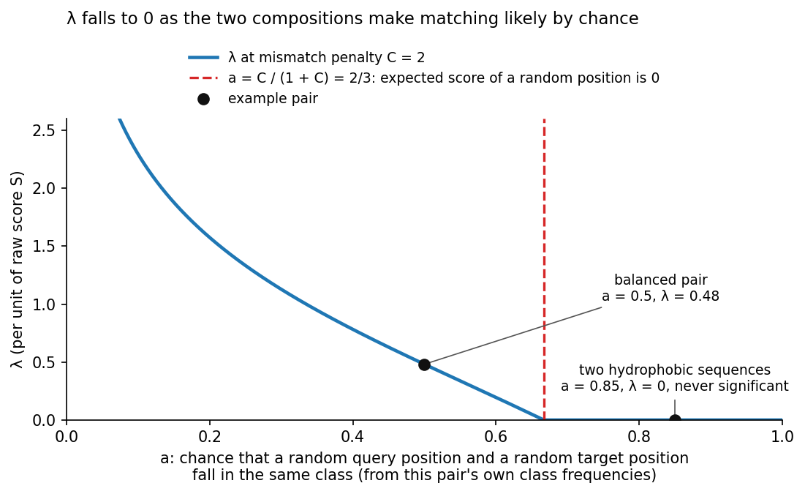
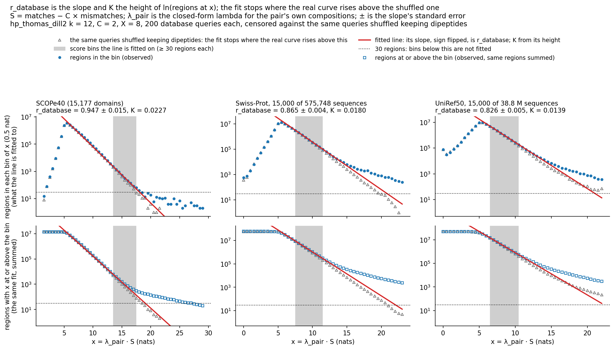
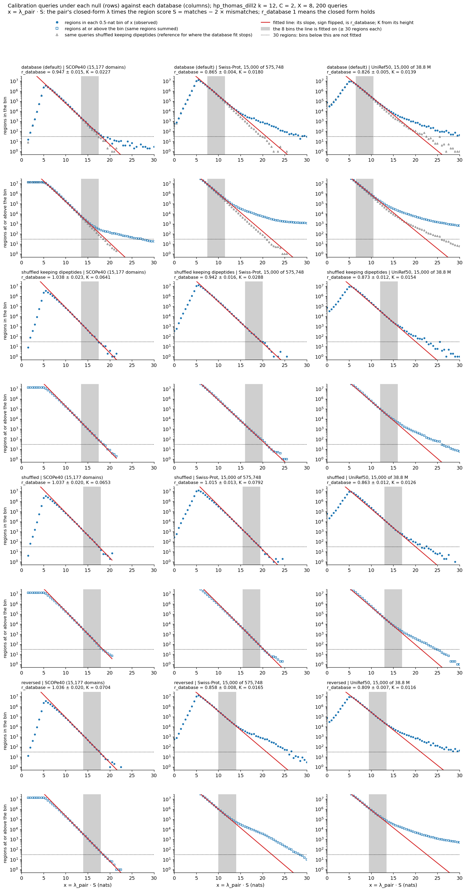

# How a region gets an E-value

`kmerseek search --extend-mismatch-penalty C` scores every extended region the way BLAST
scores an ungapped alignment, and reports the result in two CSV columns: `region_evalue`,
the number of regions at least this good expected between an unrelated query and the
whole database (smaller is better), and `region_ka_bits`, the same evidence on BLAST's
bit scale (larger is better). This page names every quantity in the formula, says where
each one comes from, and shows the fit that supplies the two constants. The code is in
`src/rust/evalue.rs` and the search side of `src/rust/search.rs`.

```
E    = K × m × n × e^(-λ_pair × r_database × S)
bits = (λ_pair × r_database × S - ln K) / ln 2
```

## Why regions are extended at all

An exact run in the encoded alphabet is a seed, not the match. Between remote homologs
the hydrophobic/polar class of aligned residues agrees far above chance per position
(the copy rate, Cohen's κ, is 0.46 at 20-30% identity, twice the 20-letter alphabet's),
but the longest exact HP run between such pairs averages 12 residues, so almost none of them
share an exact 23-mer, the seed length of the exact arm (2024-kmerseek-analysis notebook
230). Every benchmark and every fitted constant below is at k = 12: the longest seed that
about half of the true pairs at 20-30% identity still share.

## The score of a region

A region starts as an exact shared k-mer. From each end the search walks outward one
residue at a time along the stored encoded sequences, adding 1 where query and target
fall in the same class and subtracting C where they differ, and remembers the best score
it has seen. It stops when the score has fallen X below that best, then cuts the region
back to where the best was. Seeds on one diagonal whose walks meet are merged.

- `S = matches - C × mismatches`: the raw score of the region.
- `C`: the mismatch penalty, `--extend-mismatch-penalty`. Default 0, which turns
  extension and this score off. The benchmarks and the fitted constants use C = 2.
- `X`: the give-up margin (BLAST's X-drop), `--extend-xdrop`, default 8. With C = 2,
  four disagreeing positions in a row cost 8 and end the walk.
- `m`: query length in residues.
- `n`: residues in the database. The index's k-mer count stands in for it.

The test `test_cli_search_extend_mismatch_penalty` shows one region before and after:
the BH1 match between CED9 and human BCL2 is an exact 19-residue run at k = 12, and with
C = 2, X = 8 it grows 7 residues to the right across two class flips.

## λ_pair: what one point of score is worth for this pair

Between two sequences that match by chance at half their positions a point is hard to
earn; between two membrane proteins that match at two thirds of their positions by luck
it is cheap. λ_pair converts a raw score into nats for the pair at hand. A nat is the
natural-log unit of chance: a region worth x nats is as rare as e^(−x) between
unrelated sequences.

- `a`: the chance that two positions drawn at random, one from the query and one from
  the target, land in the same class. It is the sum over classes of
  p_query × p_target, computed from this pair's own class frequencies (Schäffer et al.
  2001), not from one database-wide value. A balanced pair in a two-class alphabet has
  a ≈ 0.5; a pair of mostly hydrophobic sequences has a near 1.
- `λ_pair`: the positive root of `a·e^λ + (1-a)·e^(-Cλ) = 1` (Karlin & Altschul 1990),
  solved by bisection once per pair. A positive root exists only when a random aligned
  position has a negative expected score, that is when `a < C/(1+C)` (2/3 at C = 2).
  Above that line, agreeing is what the two compositions do by chance: λ_pair is 0 and no
  run of agreement is significant at any length. The Poisson count saw a membrane helix
  against any other membrane helix as a long exact run; this score does not.



Worked example: BCL2 (human, P10415) against CED9 (worm) in `hp_thomas_dill2`. Both are
about half hydrophobic, so a = 0.5 and λ_pair = 0.481 nats per point at C = 2. A region
with 48 agreeing positions and 4 disagreeing has S = 48 − 2 × 4 = 40, worth
0.481 × 40 = 19.2 nats under the independent-positions model.

## r_database and K: two numbers per index, measured when it is built

The λ_pair equation assumes each residue is drawn like a weighted coin flip with no
memory of the residue before it. Real proteins have memory: a hydrophobic residue is more
often followed by another (membrane segments, cores), and helices and strands repeat
with a period. So real sequences may reach a given score more easily than coin flips
would, and the E-value needs two corrections that the closed form cannot give:

- `r_database`: the factor by which real sequences in this database change the value of a
  point. 1.00 means the equation is right as it stands. 0.947 (SCOPe40) means one point is
  worth 5% fewer nats than the equation says: the BCL2/CED9 region above is worth
  0.481 × 0.947 × 40 = 18.2 nats and its E-value is e^(19.2 − 18.2) = 2.7× larger than
  under independence. 0.85 (Swiss-Prot) makes it 16.4 nats and the E-value 7.5× larger.
- `K`: the fraction of the m × n cells of the comparison that can start a region. Cells
  next to each other on one diagonal belong to the same run of agreement, and a region only
  exists where an exact seed matched, so K is well under 1: 0.023 on SCOPe40, 0.016 to
  0.018 on Swiss-Prot, 0.014 on UniRef50, all at `hp_thomas_dill2` k = 12, C = 2.

Both are fitted by `kmerseek index` and stored in the index under their C and X. A search
with the same pair reads them back; a search with another pair fits its own on
`--ka-queries` database sequences first, or is refused unless `--ka-k` is given.

How the fit works:

1. Take 200 sequences from the database itself (`--ka-queries`, `--ka-seed`) and search
   each against the whole index exactly as a user's query would be searched (C = 2, X = 8,
   every filter off). Hits of a sequence on its own database entry are dropped.
2. For every region of every pair, compute x = λ_pair × S: the region's raw score in the
   pair's own units, in nats, so a region at x = 15 is as rare as e^(−15) under the
   independent-positions model.
3. Count the regions in bins of x half a nat wide and plot ln(count) against x. If the
   model were right the points would fall on a straight line of slope −1, and the line's
   height would give K.
4. Fit a straight line. Minus its slope is r_database. K comes from the height:
   count in the bin at x = K × L × N × (1 − e^(−w)) × e^(−r_database × x), with L the
   residues in the 200 queries, N the residues in the database and w = 0.5 nat the bin
   width (Altschul & Gish 1996; Pearson 1998).
5. Decide which bins to fit. Some of the 200 sequences have relatives in the database,
   and related pairs produce regions with high x that unrelated pairs never would. Those
   bins must not be fitted. To find where they begin, the same 200 sequences are shuffled
   so that every pair of neighbouring residues occurs as often as in the original (this
   keeps the lengths of hydrophobic runs; Altschul & Erickson 1985, Kandel et al. 1996;
   `--ka-reference shuffled-dipeptide`), searched the same way, and counted in the same
   bins. Shuffled sequences have no relatives. Bin by bin, ln(real count) − ln(shuffled
   count) is taken; where the real sequences have only the structure the shuffle keeps,
   that difference is flat. Counts have noise of about the square root of the count. The
   first bin where the difference rises more than twice that noise above a line through
   its eight lowest bins is where relatives begin, and the fit stops there. The line is read off the eight highest bins below that point.

The fit goes to the count in each bin, not the count at or above it, because a plateau
of related pairs far up the axis would add a constant to every summed count below it and
flatten the slope there too. And it fits x rather than the raw score S because Swiss-Prot
holds pairs of membrane and low-complexity proteins whose raw scores run past 60 while
ordinary pairs stop near 45; in x each pair is already on its own λ_pair, and the biased
pairs sit at x = 0, out of the way.



Top row: regions in each half-nat bin of x, the points the line is fitted to; grey
triangles are the same queries shuffled keeping dipeptides. Bottom row: the same regions
summed. Grey band: the 8 bins used. Dotted line: 30 regions, below which a bin is not
fitted. ± is the standard error of r_database. Drawn by `scripts/plot_ka_survival.py` from
the curves under `images/ka_fit_curves/`, which `kmerseek index --ka-survival-out` writes.

| database | sequences | residues | r_database | K | bins fitted (x, nats) | relatives begin at |
|---|---|---|---|---|---|---|
| SCOPe40 | 15,177 | 2.8 M | 0.947 ± 0.015 | 0.0227 | 13.5 to 17.5 | not reached |
| Swiss-Prot sample | 15,000 of 575,748 | 5.5 M | 0.865 ± 0.004 | 0.0180 | 7.5 to 11.5 | x = 11.5 |
| Swiss-Prot sample | 60,000 of 575,748 | 21.7 M | 0.851 ± 0.003 | 0.0159 | 7.0 to 11.0 | x = 11.0 |
| UniRef50 sample | 15,000 of 38.8 M | 4.7 M | 0.826 ± 0.005 | 0.0139 | 6.5 to 10.5 | x = 10.5 |

(`hp_thomas_dill2` k = 12, C = 2, X = 8, 200 database queries, seed 1.) SCOPe40 domains
behave almost like independent positions. Full-length proteins do not: every E-value on a
proteome is larger than the closed form would give. The two Swiss-Prot samples agree to
2% in r_database and 12% in K, so a sample calibrates the full database.

What the numbers mean for a hit, for a 200-residue query:

| database | E at x = 15 | E at x = 20 | E at x = 25 |
|---|---|---|---|
| SCOPe40 (n = 2.5 M) | 7.8 | 0.068 | 6.0e-4 |
| Swiss-Prot, full (n = 210 M, 60,000-sample fit) | 1.9e3 | 27 | 0.38 |

## What the calibration queries are: `--ka-null`

The fit can be run on the database sequences as they are (the default), or on three kinds
of scrambled sequence. The scrambled kinds check the fitting code and show what each kind
of sequence structure does to the constants.



Rows: what the 200 calibration queries are. Columns: the databases. Each null has two
rows, regions per bin (what is fitted) and the same regions summed.

r_database by null and database (1.00 = the closed form is right as it stands):

| calibration queries are | SCOPe40 | Swiss-Prot sample | UniRef50 sample |
|---|---|---|---|
| `database`: the sequences as they are | 0.947 | 0.865 | 0.826 |
| `shuffled-dipeptide`: shuffled, neighbouring pairs kept | 1.038 | 0.942 | 0.873 |
| `shuffled`: shuffled | 1.037 | 1.015 | 0.863 |
| `reversed`: read back to front | 1.036 | 0.858 | 0.809 |

On SCOPe40 the three scrambled nulls agree with each other and give 1.04: the closed form
holds for scrambled domains, which checks the fitting code. Real domains give 0.95. On
Swiss-Prot a plain shuffle still gives 1.0, but keeping neighbouring pairs already pulls
the value to 0.94: hydrophobic runs alone account for a third of the gap between
scrambled and real. Reversed sequences give the same value as real ones and their curve
bends upward from x = 14: a helix or a strand reads nearly the same backwards in a
two-class alphabet, so reversed proteins still match their forward paralogs. That is why
`reversed` is a check and not a null to fit on in this alphabet.

| | `database` (default) | `shuffled-dipeptide` | `shuffled` | `reversed` |
|---|---|---|---|---|
| keeps | everything real | composition and run lengths | composition | composition, runs, periodicity |
| loses | nothing; related pairs are cut off where the curve rises above the reference | periodicity | runs and periodicity | which residue sits where; in a two-class alphabet the pattern of a helix or strand survives reversal |
| use it for | the E-values | the reference the `database` fit stops against | checking that the code reproduces the theory | checking the leak on your data |

## Chaining: `--chain-max-gap`, `--chain-max-shift`

Two extended regions on one diagonal separated by a stretch the give-up margin would not
cross are one alignment with a bad patch in it. `--chain-max-gap G --chain-max-shift D`
joins regions that follow each other on both sequences, at most G residues apart on the
query and within D diagonals of each other, into one region scored with the Karlin and
Altschul (1993) statistic for a sum of scores: each member's score in nats, less the
size of the search, is λ S_i − ln(K m n_t), and the chance that r such scores add up to
at least t is about e^(−t) t^(r−1) / (r! (r−1)!). That chance times the number of
targets is the chain's `region_evalue`. Its `region_ka_bits` is (ln(m n_t) − ln P) / ln 2,
which for a chain of one member is the single region's (λ S − ln K) / ln 2, so the two
kinds of row rank on one scale. `region_n_chained` counts the members. On SCOPe40 domains chaining barely moves ranking;
its purpose is region transfer in the QfO benchmark, where a call has to cover half a
domain to carry its label and one gapless run rarely does.

## Limits

One r_database and K per index describe a typical query. A query rich in membrane
segments has a positive expected score against every other membrane protein; its λ_pair
is 0 (no significance) and the fit puts it at x = 0, but nothing rescues it. Masking long
hydrophobic runs (what BLAST's SEG filter does for low-complexity stretches) or a
per-query fit at search time is a separate change.

## References

- Karlin S, Altschul SF (1990). Methods for assessing the statistical significance of
  molecular sequence features by using general scoring schemes. PNAS 87:2264-2268.
  λ and K for ungapped local alignment; the E-value formula.
- Karlin S, Altschul SF (1993). Applications and statistics for multiple high-scoring
  segments in molecular sequences. PNAS 90:5873-5877. The statistic for a sum of region
  scores, used by chaining.
- Altschul SF, Gish W, Miller W, Myers EW, Lipman DJ (1990). Basic local alignment search
  tool. J Mol Biol 215:403-410. Seed, ungapped extension, E-value.
- Altschul SF, Madden TL, Schäffer AA, Zhang J, Zhang Z, Miller W, Lipman DJ (1997).
  Gapped BLAST and PSI-BLAST. Nucleic Acids Res 25:3389-3402. The give-up margin.
- Schäffer AA, Aravind L, Madden TL, Shavirin S, Spouge JL, Wolf YI, Koonin EV,
  Altschul SF (2001). Improving the accuracy of PSI-BLAST protein database searches with
  composition-based statistics and other refinements. Nucleic Acids Res 29:2994-3005.
  λ from the pair's own composition.
- Altschul SF, Gish W (1996). Local alignment statistics. Methods Enzymol 266:460-480.
  Fitting λ and K from the score distribution.
- Pearson WR (1998). Empirical statistical estimates for sequence similarity searches.
  J Mol Biol 276:71-84. Fitting on the real database without labels.
- Altschul SF, Erickson BW (1985). Significance of nucleotide sequence alignments: a
  method for random sequence permutation that preserves dinucleotide and codon usage.
  Mol Biol Evol 2:526-538. The dipeptide-preserving shuffle.
- Kandel D, Matias Y, Unger R, Winkler P (1996). Shuffling biological sequences.
  Discrete Applied Mathematics 71:171-185. Sampling the shuffle as a random Eulerian path.
- Altschul SF. The statistics of sequence similarity scores. NCBI BLAST tutorial.
  https://www.ncbi.nlm.nih.gov/BLAST/tutorial/Altschul-1.html
